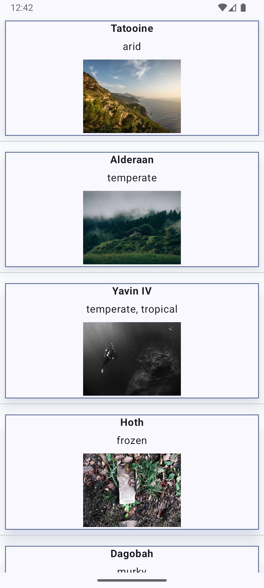
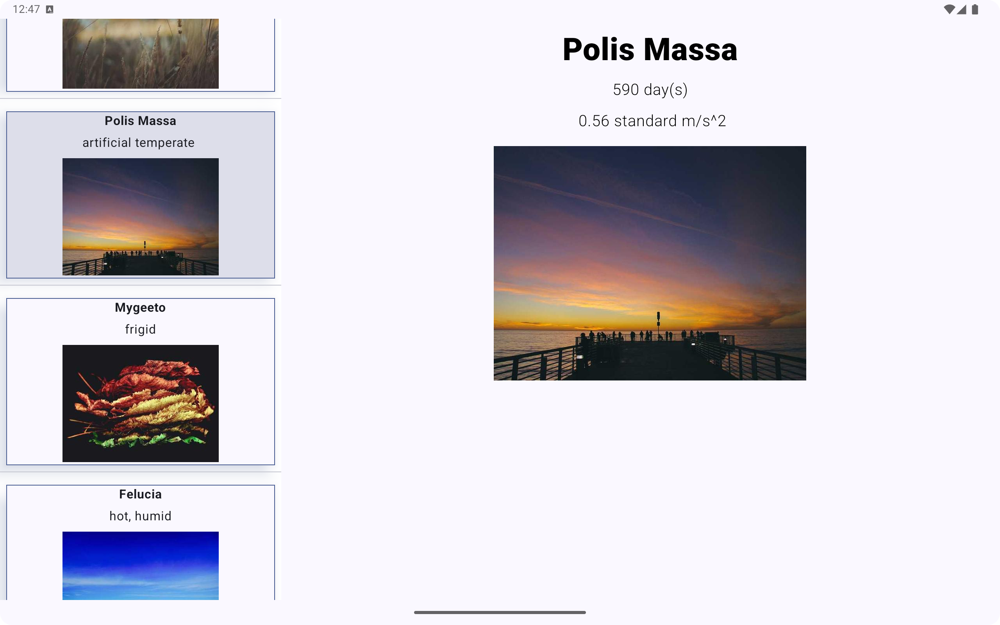

# starwars

## Coverage reports
./gradlew clean jacocoTestReport --info

## App screen shots

### Planet list page
#### Features
*  Scrolling will add new planets to the page.
*

### Planet details page
#### Features
*  Scrolling will add new planets to the page.
*

### Tablets/Larger screns
#### Features
*  List and details view on same page
* 

